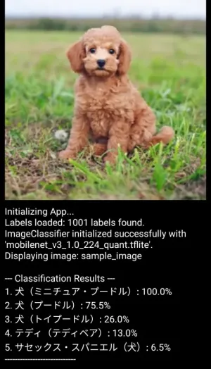

# LiteRT MobileNets Sample for Android

This Android application demonstrates image classification using pre-trained MobileNetV3 TensorFlow Lite models.

## Features

*   Image classification using:
    *   MobileNetV2 (quantized TFLite model)
    *   MobileNetV3 (quantized TFLite model)
*   Loads labels in English and Japanese.

## Result Example

## Project Structure

*   **Models & Labels:** Located in `app/src/main/assets/`
    *   `mobilenet_v2_1.0_224_quant.tflite`
    *   `mobilenet_v3_1.0_224_quant.tflite`
    *   `labels_EN.txt`
    *   `labels_JP.txt`
*   **Core Logic:** `MainActivity.kt`
*   **UI Theme (if Compose):** `app/src/main/java/com/example/litertmobilenetssample/ui/theme/`
*   **Layout (if XML):** `app/src/main/res/layout/activity_main.xml`

## How to Build and Run

1.  **Clone or Download:**
    *   Clone: `git clone https://github.com/nehori/LiteRTMobileNetsSample.git`
    *   Or download ZIP from this repository.
2.  **Open in Android Studio:**
    *   Open Android Studio.
    *   Select "Open" and navigate to the cloned/extracted project directory.
    *   Let Android Studio sync the project with Gradle.
3.  **Run:**
    *   Connect an Android device or start an emulator.
    *   Click the "Run 'app'" button (green play icon) in Android Studio.

## Download Pre-built APK

You can download the latest pre-built APK from the **[Releases page](https://github.com/nehori/LiteRTMobileNetsSample/releases)**.

Or directly download:
*   [LiteRTMobileNetsSample-v1.0.apk](https://github.com/nehori/LiteRTMobileNetsSample/releases/download/v1.0/LiteRTMobileNetsSample-v1.0.apk)

## License

This is free and unencumbered software released into the public domain. See [LICENSE](LICENSE).

